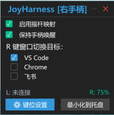
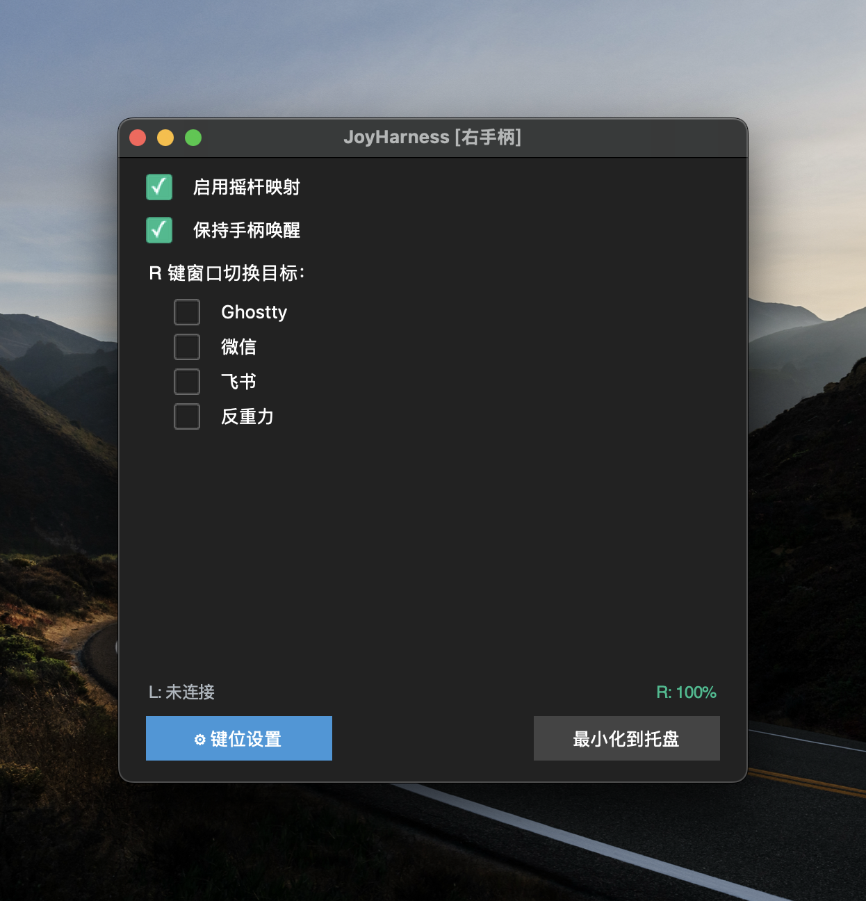

# JoyHarness

将 Nintendo Switch Joy-Con 手柄通过蓝牙映射为键盘快捷键。支持单左手柄、单右手柄、双手柄三种连接模式，自动检测并热切换配置档。

Map Nintendo Switch Joy-Con controllers to keyboard shortcuts via Bluetooth. Supports single left, single right, and dual Joy-Con modes with automatic connection detection and hot-plug switching.

> **本 Fork** 在原项目 [VaderCheng/JoyHarness](https://github.com/VaderCheng/JoyHarness)（仅 Windows）基础上增加了完整的 **macOS 支持**。详见 [本 Fork 变更](#本-fork-变更)。
>
> **This fork** adds full **macOS support** to the original [VaderCheng/JoyHarness](https://github.com/VaderCheng/JoyHarness) (Windows-only). See [Changes in this fork](#changes-in-this-fork) for details.

## 界面预览 / Preview

| Windows | macOS |
|---------|-------|
|  |  |

## 功能特性 / Features

- **多手柄支持** — 自动检测连接模式（右手柄 / 左手柄 / 双手柄），切换对应的键位映射配置档
- **热插拔** — 运行中断开重连自动恢复；连接模式变化自动切换配置档
- **按键映射** — 支持 tap（点击）、hold（长按）、auto（自适应）、combination（组合键）、sequence（序列键）、macro（宏）、window_switch（窗口切换）、exec（执行命令）
- **摇杆映射** — 4/8 方向映射到键盘按键，可配置死区
- **窗口切换** — R 键快速切换指定应用窗口（类似 Alt+Tab）
- **系统托盘** — 最小化到托盘运行
- **GUI 设置界面** — 可视化编辑按键映射和切换应用列表
- **校准工具** — 交互式按钮/摇杆索引校准
- **电量显示** — HID 读取 L/R 两侧 Joy-Con 电量
- **保活防休眠** — 周期性零强度震动防止手柄自动休眠

---

- **Multi-controller support** — auto-detects connection mode and switches keymap profiles
- **Hot-plug** — disconnect/reconnect auto-recovery and auto-switch
- **Button mapping** — tap, hold, auto, combination, sequence, macro, window_switch, exec
- **Joystick mapping** — 4/8 direction with configurable deadzone
- **Window cycling** — quick-switch between target apps
- **System tray** — minimize to tray, run in background
- **GUI settings** — visual editor for mappings and app list
- **Calibration tool** — interactive button/joystick index calibration
- **Battery display** — HID battery level for both L and R Joy-Cons
- **Keep-alive** — prevents Joy-Con auto-sleep via periodic zero-intensity rumble

## 快速开始 / Quick Start

### 环境要求 / Requirements

- **Windows 11** 或 **macOS 13+**（实测 macOS 15.7，Apple Silicon M4）
- Python 3.10+
- Joy-Con 已通过蓝牙配对

### 安装 / Install

```bash
pip install -r requirements.txt
```

`requirements.txt` 已配置平台条件依赖：Windows 自动安装 `keyboard`，macOS 自动安装 `pynput` + PyObjC 框架。

### 蓝牙配对 / Bluetooth Pairing

**Windows：**
1. 设置 → 蓝牙和设备 → 添加设备
2. 按住 Joy-Con 滑轨上的小配对按钮 3 秒，指示灯快速闪烁
3. 在蓝牙列表中选择 "Joy-Con R" 或 "Joy-Con L"

**macOS：**
1. 系统设置 → 蓝牙
2. 按住 Joy-Con 滑轨上的小配对按钮 3 秒，指示灯快速闪烁
3. 在蓝牙列表中选择 "Joy-Con (R)" 或 "Joy-Con (L)"

### 运行 / Run

```bash
python -m src
```

macOS 可双击 `start.command`，Windows 可双击 `start.vbs`。

首次运行时，macOS 可能请求 **辅助功能** 和 **输入监控** 权限，请在 **系统设置 → 隐私与安全性** 中授予。

### 命令行参数 / CLI Options

```
python -m src --config custom.json   # 使用自定义配置 / Use custom config
python -m src --discover             # 调试模式：显示按钮/轴原始值 / Debug mode
python -m src --deadzone 0.2         # 覆盖死区值 / Override deadzone
python -m src --list-controls        # 列出当前映射 / List current mappings
python -m src --verbose              # 调试日志 / Debug logging
python -m src --joystick 0           # 指定手柄设备索引 / Specify joystick index
python -m src --version              # 显示版本号 / Show version
```

### 校准 / Calibration

如果按钮索引不正确（因驱动/手柄型号而异），运行校准工具：

```bash
python calibrate.py
```

按提示逐一按下按钮和推动摇杆，程序会生成 `calibration_result.json` 并输出需要更新的常量。

## 配置说明 / Configuration

配置文件为 JSON 格式，位于 `config/user.json`（自动生成）或 `config/default.json`。支持三种连接模式的独立配置档：

```json
{
  "version": "2.0",
  "deadzone": 0.2,
  "poll_interval": 0.01,
  "stick_mode": "4dir",
  "switch_scroll_interval": 400,
  "active_profile": "single_right",
  "profiles": {
    "single_right": { "mappings": { "buttons": {...}, "stick_directions": {...} } },
    "single_left":  { "mappings": { "buttons": {...}, "stick_directions": {...} } },
    "dual":         { "mappings": { "buttons": {...}, "stick_directions": {...} } }
  },
  "known_apps": { "VS Code": "Code" },
  "selected_apps": ["Code"]
}
```

### 连接模式 / Connection Modes

| 模式 / Mode | 标签 / Label | 可用按钮 / Available Buttons |
|------|-------|-------------------|
| `single_right` | 右手柄 | A/B/X/Y/R/ZR/Plus/Home/RStick/SL/SR |
| `single_left` | 左手柄 | A/B/X/Y/L/ZL/Minus/Capture/LStick/SL/SR |
| `dual` | 左右手柄 | 以上全部 / All of the above |

旧版配置格式（顶级 `mappings`）会自动迁移为 `profiles.single_right`。

### 动作类型 / Action Types

| 动作 / Action | 说明 / Description |
|--------|-------------|
| **tap** | 点击：按下后立即松开 |
| **hold** | 长按：按下保持，松开时释放（适合修饰键） |
| **auto** | 自适应：短按（<250ms）= tap，长按 = hold。支持 `repeat` 字段实现连续重击（如退格键） |
| **combination** | 组合键：同时按下多个键（如 Ctrl+S / Cmd+S） |
| **sequence** | 序列键：按住修饰键 + 依次点击其他键，松开时释放（如 Alt+Tab 循环） |
| **window_switch** | 窗口切换：短按 = 下一个，长按 = 弹出叠加选择器 |
| **macro** | 宏：执行预定义的按键序列，可按前台窗口过滤 |
| **exec** *(macOS)* | 执行命令：触发任意 shell 命令，用于调用系统级功能（如 Mission Control） |

### exec 动作（macOS 专用）

macOS 上 `pynput` 合成的按键事件无法触发系统级快捷键（如 F3 → Mission Control），请用 `exec` 替代：

```json
"R": {
  "action": "exec",
  "command": ["open", "-a", "Mission Control"]
}
```

### auto 重击字段 / auto Repeat (macOS)

macOS 上 pynput 合成的 keyDown 不会触发系统级的自动连发。对退格键、方向键等需要连发的场景，添加 `repeat` 字段（间隔毫秒）：

```json
"B": {
  "action": "auto",
  "key": "backspace",
  "repeat": 100
}
```

短按一次退格；长按则每 100ms 连续退格。

## 项目结构 / Project Structure

```
src/
├── main.py              # CLI 入口 + 线程编排
├── config_loader.py     # JSON 配置加载/校验/保存（多配置档）
├── constants.py         # 硬件常量、默认映射、多模式按钮索引
├── joycon_reader.py     # pygame 手柄轮询 (100Hz)、模式检测、热插拔重连
├── joystick_handler.py  # 死区算法、方向判定
├── key_mapper.py        # 事件翻译引擎（核心）、配置档热切换
├── keyboard_output.py   # 键盘模拟（跨平台：Windows=keyboard / macOS=pynput）
├── window_switcher.py   # 窗口枚举/切换（跨平台：Win32 / Quartz+AppleScript）
├── gui.py               # 主窗口（显示当前连接模式）
├── settings_window.py   # 设置面板（自动适配当前模式的按钮列表）
├── switcher_overlay.py  # 窗口切换叠加层（Alt+Tab 风格）
├── tray_icon.py         # 系统托盘图标
├── battery_reader.py    # HID 电量读取
├── keep_alive.py        # 保活防手柄休眠
├── resizable.py         # 无边框窗口拖拽（仅 Windows）
└── platform/
    ├── __init__.py      # 平台检测
    └── permission.py    # 权限检查（Windows 管理员 / macOS 辅助功能）
```

## 依赖 / Dependencies

| 库 / Library | 用途 / Purpose |
|---------|---------|
| [pygame](https://www.pygame.org/) | 手柄输入 / Joystick input |
| [keyboard](https://github.com/boppreh/keyboard) | 键盘模拟（Windows） |
| [pynput](https://github.com/moses-palmer/pynput) | 键盘模拟（macOS） |
| [pystray](https://github.com/moses-palmer/pystray) | 系统托盘 / System tray |
| [ttkbootstrap](https://github.com/israel-dryer/ttkbootstrap) | GUI 主题 / GUI theme |
| [Pillow](https://python-pillow.org/) | 图像处理（pystray 依赖） |
| [hidapi](https://github.com/libusb/hidapi) | HID 电量读取 + 保活 |
| pyobjc-framework-Cocoa | macOS 窗口/应用管理 |
| pyobjc-framework-Quartz | macOS 窗口枚举（快速路径） |

## macOS 注意事项 / macOS Notes

### 权限 / Permissions
- **辅助功能（Accessibility）**：键盘模拟和窗口激活都需要
- **输入监控（Input Monitoring）**：pynput 需要

### Spaces / 全屏
- `CGWindowListCopyWindowInfo` 只看**当前 macOS Space**。如果某个 app 全屏在另一个桌面、最小化、或被隐藏（Cmd+H），window_switch 找不到它的窗口
- 全屏场景下推荐使用 `exec` 动作触发 Mission Control

### 系统级快捷键 / System-level Hotkeys
- 部分 macOS 快捷键（如 F3、Ctrl+Up 调出 Mission Control）**只响应硬件 HID 事件**，不响应 pynput 合成的 CGEvent
- 这类场景请用 `exec` 动作 + `open -a` 或 AppleScript

### 进程名 / Process Names
- `find_windows` 使用的是 `kCGWindowOwnerName`，这是**本地化名**。中文系统下微信进程名是 `微信`，不是 `WeChat`
- 配置时进程名**大小写敏感**（`Antigravity` ≠ `antigravity`）

### 侧键 R / SL / SR 未正确触发
- 原版中 SL / SR 侧键映射到 window_switch 功能，但在 macOS 上 SDL2 的侧键事件检测不稳定，时灵时不灵
- 临时方案：已将默认映射改为 **F3**（Mission Control），用户可自行在配置中改回其他键
- 根本原因待排查（可能是 macOS 蓝牙 HID 报告格式与 Windows 不同），欢迎贡献修复

## 本 Fork 变更 / Changes in this fork

本 Fork 在 [@VaderCheng](https://github.com/VaderCheng/JoyHarness) 的 Windows 原版基础上增加了 macOS 支持。主要变更：

This fork adds macOS support to the original Windows-only project by [@VaderCheng](https://github.com/VaderCheng/JoyHarness). Key changes:

### 平台支持 / Platform Support
- **完整 macOS 支持** — 键盘模拟、窗口枚举/切换、HID 电量读取、Joy-Con 保活、热插拔重连、系统托盘、GUI 全部跑通
- **依赖按平台分流** — Windows 装 `keyboard`，macOS 装 `pynput` + PyObjC

### 新功能 / New Features
- **`exec` 动作类型** — 把任意 shell 命令绑到按键，用于触发 macOS 系统功能（Mission Control、Launchpad、锁屏、截图……）
- **`auto` 的 `repeat` 字段** — 软件模拟自动连发，解决 macOS 上合成键 keyDown 不触发系统级 auto-repeat 的问题

### 原版 Bug 修复 / Bug Fixes
| Bug | 原因 / Cause | 修复 / Fix |
|-----|-------|-----|
| 8 向摇杆方向判定错误 | 角度分区错误，0° 附近方向判断出错，列表有重复 "right" | 修正为正确的 8 等分 45° 扇区 |
| 窗口切换状态机缺陷 | 多个按钮可能干扰切换状态 | 新增 `_ws_button_index` 追踪触发按钮 |
| GUI 保存把所有进程名小写 | Windows-era 假设：exe 名大小写不敏感 | macOS 移除 `.lower()`，保持大小写敏感 |
| GUI 保存 `auto` 动作丢失 `repeat` | 仅 `sequence` 动作保留了 `repeat` | 扩展到 `auto` 也保留 |

### 性能优化 / Performance
- **Window switcher 重写** — 用 PyObjC + Quartz 替代 AppleScript 子进程调用，延迟从 ~400-700ms 降至 ~10-30ms。PyObjC 未安装时自动回退到 AppleScript。

### 已知问题 / Known Issues
- **侧键 SL/SR 在 macOS 上不稳定** — SDL2 对侧键的蓝牙 HID 报告检测时灵时不灵，原版的 window_switch 映射不可靠。临时方案：默认映射改为 F3。欢迎熟悉 macOS 蓝牙 HID 的朋友一起排查。

## 许可证 / License

[MIT](LICENSE)
